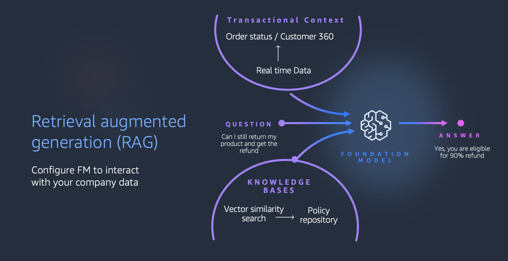
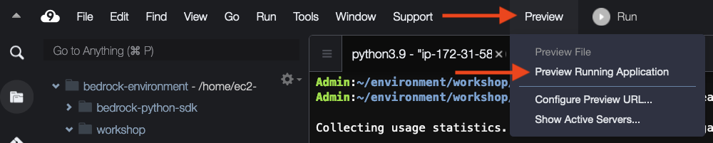
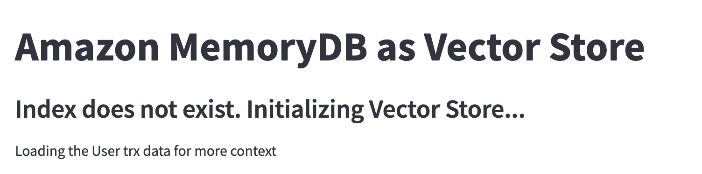
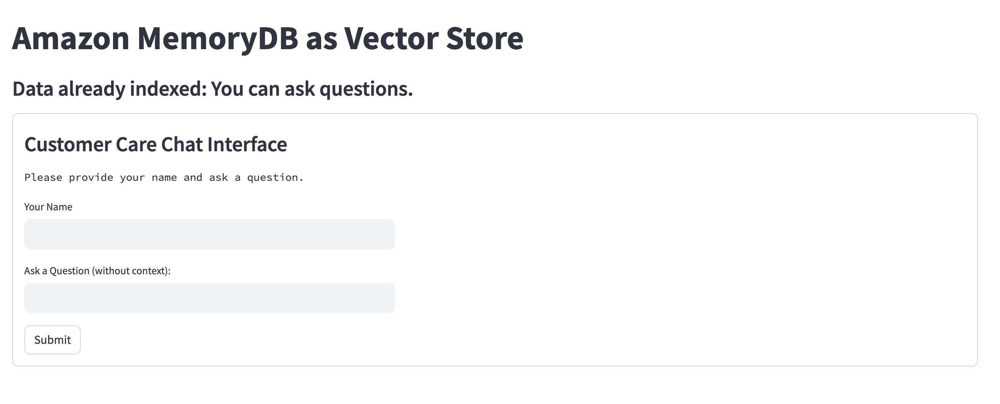
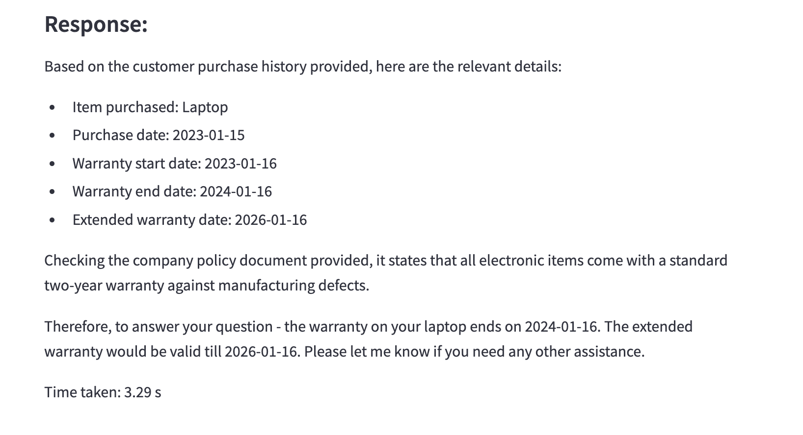

# Amazon MemoryDB for Redis 
## Retrieval Augmented Generation with MemoryDB as VectorStore 

In a basic Generative AI application, the user provides an input to the application. The application invokes the LLM with the user input packaged as a prompt. The LLM responds with the model’s inference and the application presents the response back to the user. Based on what the model was trained on, the LLM will give you a generic response.

To differentiate your Gen AI application with your data, you provide more context to the LLM. There are three key elements:

1. **Provide instructions** on how you want the LLM to behave. This is typically done through predefined prompt templates. 
2. **Provide situational context** including relevant conversation history and state, and user information to make responses more personal. This data is usually retrieved from purpose-built data stores and APIs.
3. **Provide semantic context** by using meaningfully relevant data that would help the response. This is typically obtained from vector stores and search.

In this lab, we will use an in-memory database, Amazon MemoryDB, to demonstrate this pattern.

We will walk you through the steps to deploy a Python chatbot application using Streamlit on Cloud9. This is the architecture we will be implementing today.



The application is contained in the `chatbot_app.py` file, and it requires specific packages listed in `requirements.txt`.

## Prerequisites

Before you proceed, make sure you have the following prerequisites in place:

1. An AWS Cloud9 development environment set up.
2. We will be using [Amazon Bedrock](https://aws.amazon.com/bedrock/) to access foundation models in this workshop.
3. Enable foundation models such as Claude, as shown below:

   

4. Python and pip installed in your Cloud9 environment.
5. Internet connectivity to download packages.

## Installation

1. **Clone this repository** to your Cloud9 environment:

    ```bash
    git clone https://github.com/aws-samples/amazon-memorydb-for-redis-samples
    cd tutorials/ContextEngineering
    ```

2. **Install the required packages** using pip:

    ```bash
    pip install -r requirements.txt -U
    ```

3. **Use langchain vectorstore plugin for MemoryDB** For details [Langchain aws Official Website](https://python.langchain.com/v0.2/docs/integrations/platforms/aws/).

    ```bash
        from langchain_aws.vectorstores.inmemorydb import InMemoryVectorStore

        vds = InMemoryVectorStore.from_documents(
            chunks,
            embeddings,
            redis_url="rediss://cluster_endpoint:6379/ssl=True ssl_cert_reqs=none",
            vector_schema=vector_schema,
            index_name=INDEX_NAME,
        ) 
    ```
4. **Configure environment variables** as relevant to your environment. The parameters below can use the default values, and you can skip the export below if the defaults are not updated:

    ```bash
    export MEMORYDB_CLUSTER=rediss://CLUSTER_ENDPOINT:PORT
    ```

5. **Run the application** on the terminal:

    ```bash
    streamlit run 'chatbot_app.py' --server.port 8080
    ```

6. **Open the browser** to load the application or use the Cloud9 Preview application functionality:

    

## Features

### Initial User Data Load

In this application, Amazon MemoryDB is also used as a durable user 360 data store. For the sake of the demo, we only store purchase history with product details and warranty dates.

### Vector Store Creation

The actual policy document that has warranty policy, return policy, and the call center to contact is stored in a PDF file. We use this for our semantic context. The information in the PDF is vectorized, and the embeddings and the data are stored in Amazon MemoryDB as a hash dataset.

### Using Vector Database for RAG

If the index is already created, the following appears when we first load the application:



### Testing Context-Based Learning

The vector database has a sample policy document on return policy for various items a store handles. 

In an application, when you log in, the user transaction history is retrieved from a primary datastore. In this example, we retrieve the user transaction history from MemoryDB for additional situational context. 

Here are a few sample questions you can ask:

1. When can I return my product?
2. What is my refund policy?

Enter a sample user name, say `user001`. We stored `user001`-`user012` information in MemoryDB during index creation.



### LangChain Framework for Building Chatbot with Amazon Bedrock

LangChain provides easy ways to incorporate modular utilities into chains. It allows us to easily define and interact with different types of abstractions, making it easy to build powerful chatbots.

### Chatbot with Context

In this use case, we will ask the chatbot to answer questions from some external corpus. To do this, we apply a pattern called RAG (Retrieval Augmented Generation): the idea is to index the corpus in chunks, then look up which sections of the corpus might be relevant to provide an answer by using semantic similarity between the chunks and the question. Finally, the most relevant chunks are aggregated and passed as context in addition to providing context on user transaction history.

We will take a policy file and use **Titan Embeddings Model** to create vectors. This vector is then stored in Amazon MemoryDB, an in-memory vector database.

When the chatbot is asked a question, we query MemoryDB for transaction history and also run a similarity search. This will be our answer.



### Similarity Search

We can expand the User transaction history  and Similarity Search sections to see the relevant context being shared with the LLM for a more personalized response.

## Security
See   [CONTRIBUTING](CONTRIBUTING.md) for more information.

## License
This library is licensed under the MIT-0 License. See the [LICENSE](LICENSE.md) file.

