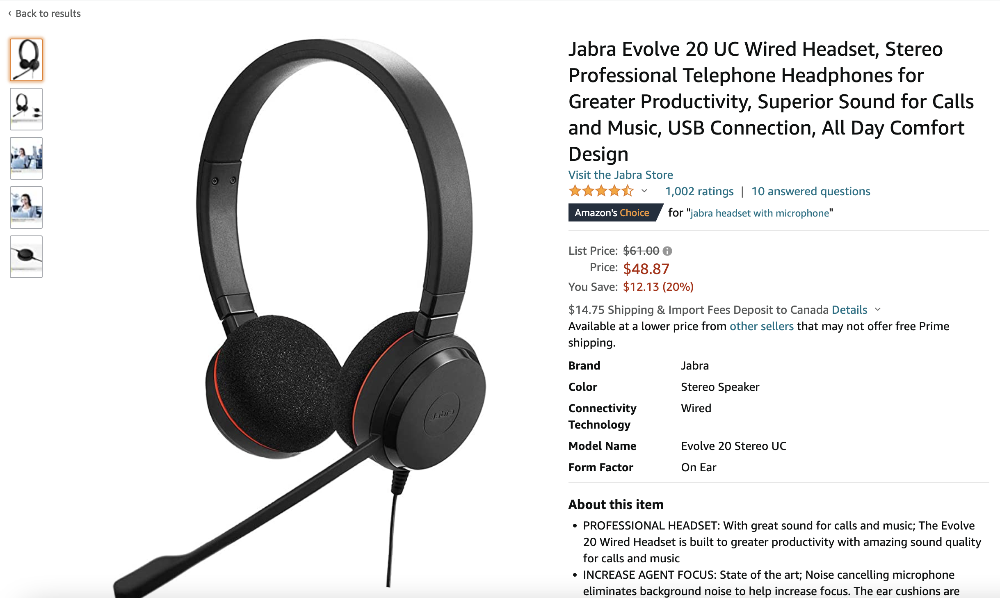

# Amazon MemoryDB for Redis 
## Similarity Search with MemoryDB as VectorStore 
Semantic search is a technique that uses Machine Learning to understand the meaning of a search query to delivery more relevant search results. For example, when we search questions from stackoverflow, we want to find questions that are semantically similiar to our question, so we can view the most relevant answer. Sematic search is also used in e-commerce websites. For example, if we want to buy a headset from Amazon, we can get general information from the product title, description and other features, as shown below.

However, we may have a question about the headset, and we might want to search the questions asked by others to find the answer. When we type our question, we want to find semantically similar questions (which have the same meaning, while using different words). This is an example where semantic search will help us return more relevant results.

Here's an example: suppose we want to ask if a particular headset is compatible with windows 10, and we ask the question "Does this work with Windows 10?". Suppose also that we have the following in our Q&A data set:

Is it compatible with Windows 10?
Does the volume go up to 10?
Can I use this for work?
Is this compatible with a Microsoft laptop?
If we use text search, we would expect to return results for questions that match words such as "Windows", "10" and "Work", which will match some questions that aren't particularly relevant to our question. With semantic search, we would expect to find results that have a similar meaning, despite using different words. In this example, we will get more meaningful results.

