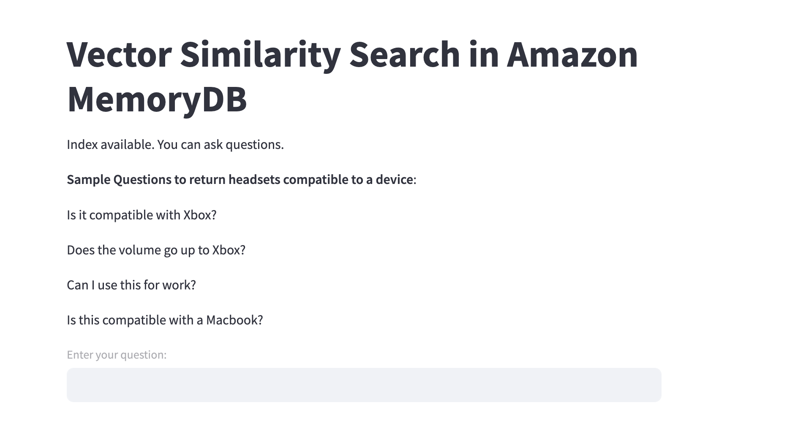
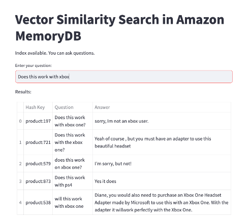

# Amazon MemoryDB

## Similarity Search with MemoryDB as VectorStore 

Semantic search is a technique that uses Machine Learning to understand the meaning of a search query to deliver more relevant search results. For example, when we search questions from Stack Overflow, we want to find questions that are semantically similar to our question, so we can view the most relevant answer. Semantic search is also used in e-commerce websites. For example, if we want to buy a headset from Amazon, we can get general information from the product title, description, and other features.


However, we may have a question about the headset, and we might want to search the questions asked by others to find the answer. When we type our question, we want to find semantically similar questions (which have the same meaning, while using different words). This is an example where semantic search will help us return more relevant results.

## Prerequisites

Before you proceed, make sure you have the following prerequisites in place:

1. An AWS Cloud9 development environment set up.
2. We will be using sentence transformers from Huggingface. 
3. Python and pip installed in your Cloud9 environment.
4. Internet connectivity to download packages.

## Installation

1. Clone this repository to your Cloud9 environment:
    ```bash
    git clone https://github.com/aws-samples/amazon-memorydb-for-redis-samples
    cd tutorials/SimilaritySearch/
    ```

2. Install the required packages using pip:
    ```bash
    pip3 install -r requirements.txt
    ```
3. Download the json file from the amazon pqa for Headset
    ```bash
    aws s3 cp --no-sign-request s3://amazon-pqa/amazon_pqa_headsets.json ./amazon-pqa/amazon_pqa_headsets.json
    ```
4. Set Amazon MemoryDB cluster endpoint 
    ```bash
    export MEMORYDB_CLUSTER="Your cluster endpoint"
    ```
5. Running the application:
    ```bash
    cd memorydb-vss
    streamlit run 'mmapp.py' --server.port 8080
    ```

6. Create index and store embeddings in MemoryDB 


    At this step, the index is first created. We then load the PQA question, answer, and embeddings data as HASHES to MemoryDB. 

7. Once the index is created, query the data store to find similar results. 


    Here's an example: suppose we want to ask if a particular headset is compatible with PC, and we ask the question "Does this work with my PC?". Suppose also that we have the following in our Q&A data set:

8. If we use text search, we would expect to return results for questions that match words such as "Windows", "10", and "Work", which will match some questions that aren't particularly relevant to our question. With semantic search, we would expect to find results that have a similar meaning, despite using different words. In this example, we will get more meaningful results.


