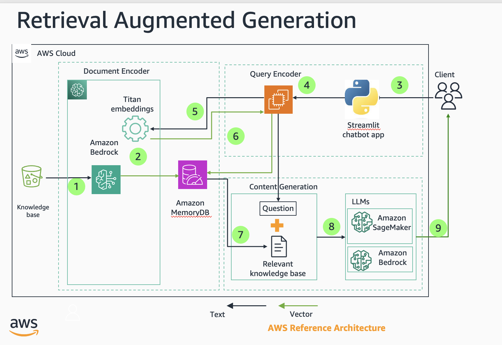
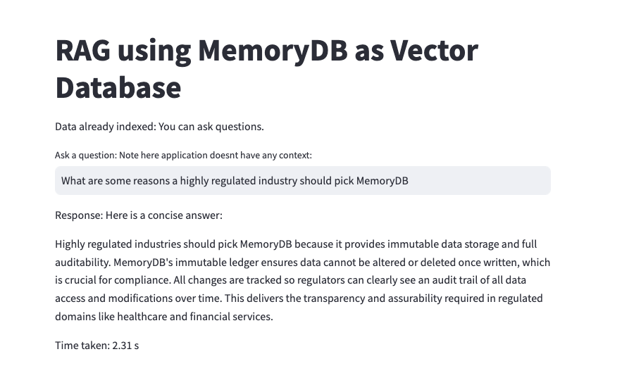
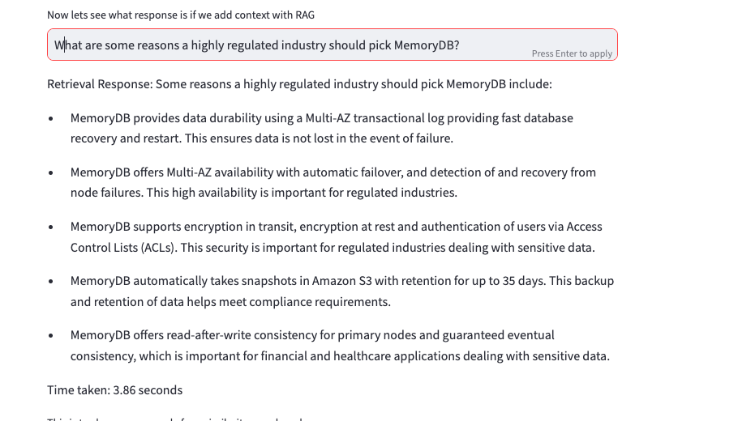
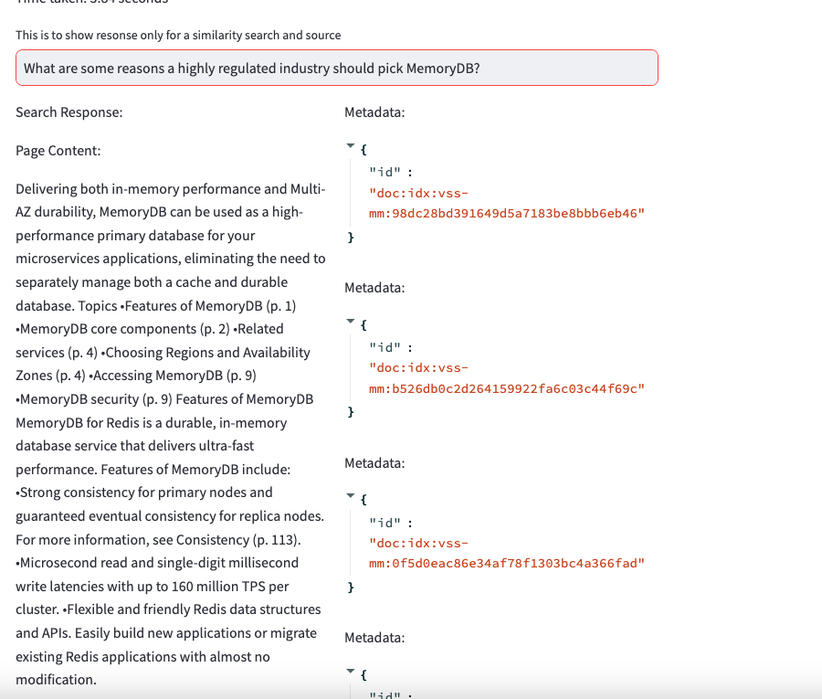

# Amazon MemoryDB
## Retrieval Augmented Generation with MemoryDB as VectorStore 

Large language models are prone to hallucination, which is just a fancy word for making up a response. To correctly and consistently answer questions, we need to ensure that the model has real information available to support its responses. We use the Retrieval-Augmented Generation (RAG) pattern to make this happen.

With Retrieval-Augmented Generation, we first pass a user's prompt to a data store. This might be in the form of a query to Amazon Kendra . We could also create a numerical representation of the prompt using Amazon Titan Embeddings to pass to a vector database. We then retrieve the most relevant content from the data store to support the large language model's response.

In this lab, we will use an in-memory database Amazon MemoryDB  to demonstrate the RAG pattern. 

We will walk you through the steps to deploy a Python chatbot application using Streamlit on Cloud9. This is the architecture we will be implementing today.



The application is contained in the `ragmm_app.py` file, and it requires specific packages listed in `requirements.txt`.

## Prerequisites

Before you proceed, make sure you have the following prerequisites in place:

1. An AWS Cloud9 development environment set up.
2. We will be using [Amazon Bedrock](https://aws.amazon.com/bedrock/) to access foundation models in this workshop.
3. Enable Foundation models such as Claude, as shown below:

   

4. Python and pip installed in your Cloud9 environment.
5. Internet connectivity to download packages.

## Installation

1. Clone this repository to your Cloud9 environment:
```bash
git clone https://github.com/aws-samples/amazon-memorydb-for-redis-samples
cd tutorials/memorydb-rag
```

2. Install the required packages using pip:
```bash
pip3 install -r requirements.txt -U
```

3. Install  langchain vectorstore plugin for MemoryDB
```bash
cd tutorials/langchain-memorydb
pip install . 
```

**To use the MemoryDB VectorStore langchain plugin in your application ensure you have an import as below import the class MemoryDB**
```python
from langchain_memorydb import MemoryDB as Redis
````

4. Configure environment variables (optional) .
```bash

export MEMORYDB_CLUSTER=rediss://CLUSTER_ENDPOINT:PORT
export BWB_ENDPOINT_URL=https://bedrock-runtime.us-east-1.amazonaws.com
```

4. Running the application
```bash
streamlit run 'ragmm_app.py' --server.port 8080
```

## Features 

## Vector Store creation
If the index is not created and data is not loaded into MemoryDB then you can select this radio button. 

## Using Vector database for RAG 

If the index is already created below appear when we first load the application. 


## Testing context based learning and retriever capabilities 
The vector database has MemoryDB developer guide. 

For more detailed information, refer to the [MemoryDB Developer Guide](https://docs.aws.amazon.com/pdfs/memorydb/latest/devguide/memorydb-guide.pdf.pdf#what-is-memorydb-for-redis).

Here are a few sample questions we can ask

1. What is MemoryDB for Redis?
2. How do you create a MemoryDB cluster?
3. What are some reasons a highly regulated industry should pick MemoryDB?



## Langchain framework for building Chatbot with Amazon Bedrock
LangChain provides easy ways to incorporate modular utilities into chains.
It allows us to easily define and interact with different types of abstractions, which make it easy to build powerful chatbots.

## Building Chatbot with Context - Key Elements

## Chatbot with Context 
In this use case we will ask the Chatbot to answer question from some external corpus. To do this we apply a pattern called RAG (Retrieval Augmented Generation): the idea is to index the corpus in chunks, then look up which sections of the corpus might be relevant to provide an answer by using semantic similarity between the chunks and the question. Finally the most relevant chunks are aggregated and passed as context to the ConversationChain, similar to providing a history.

We will take a PDF file and use **Titan Embeddings Model** to create vectors. This vector is then stored in Amazon MemoryDB, in-memory vector datbase. 

When the chatbot is asked a question, we query MemoryDB with the question and retrieve the text which is semantically closest. This will be our answer.



## Similarity search 
To see what the input prompt is to the LLM we can execute this search directly on the document store which runs a VSS 


